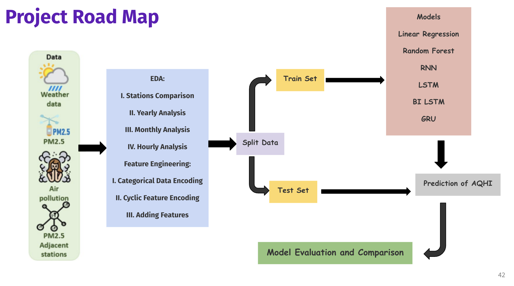
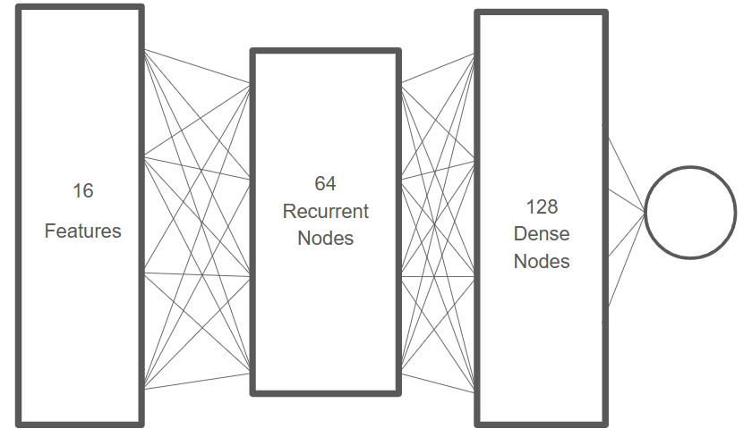
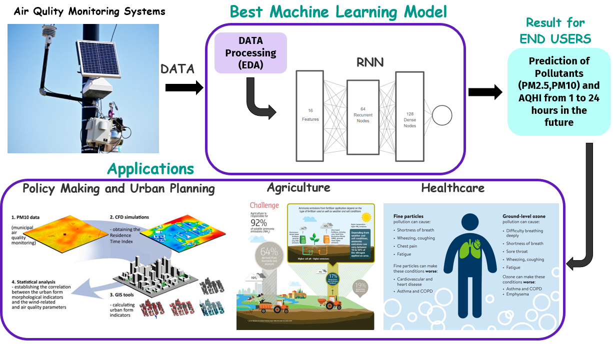

## Architecture Diagrams and Next Steps

### Architecture Diagrams:

#### Project Flow:

The system pulls data from various sources, including historical datasets on air quality, meteorological conditions, and geographical information. These datasets are preprocessed to extract relevant features and ensure data quality before being fed into the models.

#### Best Model Architecture:

#### Model Evaluation:
After training, the models are evaluated using metrics such as root mean square error (RMSE), mean absolute error (MAE), and R-squared (R2) to assess their performance in predicting air quality parameters and Air Quality Health Index (AQHI).

#### Model Deployment (End user):

### Next Steps:

#### Deployment Strategy:
Moving forward, a key aspect is to devise a deployment strategy for the final model(s). This involves packaging the trained models into deployable units, integrating them with a production environment, and setting up a robust monitoring system to track model performance in real-time.

#### Data Integration:
Integration with real-time data sources, such as IoT sensors or weather APIs, can enhance the model's predictive capabilities by incorporating up-to-date information into the predictions. This integration requires establishing data pipelines and ensuring data consistency and reliability.

#### Results Delivery:
The final step involves delivering model predictions and insights to end-users. This can be achieved through various channels such as web interfaces, APIs for programmatic access, or scheduled reports. The focus here is on providing actionable insights derived from the models to support decision-making processes related to air quality management and public health.

While specific integrations and dashboard designs are not included in this lab, having a clear vision of the architecture and next steps sets the foundation for future developments in deploying and operationalizing machine learning models for air quality prediction and management.
